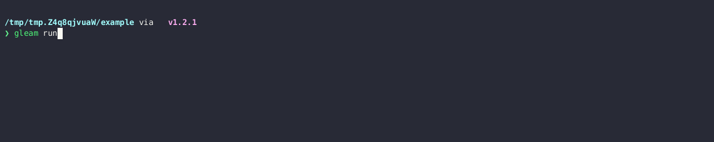

<h1 align="center">
  <a href="https://github.com/miampf/glitzer">
    <!-- Please provide path to your logo here -->
    
  </a>
</h1>

<div align="center">
  glitzer
  <br />
  <br />
  <a href="https://github.com/miampf/glitzer/issues/new?assignees=&labels=bug&template=01_BUG_REPORT.md&title=bug%3A+">Report a Bug</a>
  ·
  <a href="https://github.com/miampf/glitzer/issues/new?assignees=&labels=enhancement&template=02_FEATURE_REQUEST.md&title=feat%3A+">Request a Feature</a>
  .
  <a href="https://github.com/miampf/glitzer/issues/new?assignees=&labels=question&template=04_SUPPORT_QUESTION.md&title=support%3A+">Ask a Question</a>
</div>

<div align="center">
<br />

[](https://github.com/miampf/glitzer/issues?q=is%3Aissue+is%3Aopen+label%3A%22help+wanted%22)
[](https://github.com/miampf)

[](https://hex.pm/packages/glitzer)
[](https://hexdocs.pm/glitzer/)

</div>

<details open="open">
<summary>Table of Contents</summary>

- [About](#about)
- [Getting Started](#getting-started)
  - [Installation](#installation)
- [Usage](#usage)
  - [A simple progress bar](#a-simple-progress-bar)
  - [Progress bar templates](#progress-bar-templates)
- [Roadmap](#roadmap)
- [Support](#support)
- [Project assistance](#project-assistance)
- [Contributing](#contributing)
- [License](#license)
- [Acknowledgements](#acknowledgements)

</details>

---

## About

Glitzer (german for "glitter" or "sparkle") is a library for gleam that helps
you create progress bars and other fancy progress reporting and command line
utilities. It is written in pure gleam and supports javascript and erlang.



## Getting Started

### Installation

Simply run

```sh
gleam add glitzer
```

in your projects root directory to add the library to your project.

## Usage

You can access the progress bars with `import glitzer/progress`.

### A simple progress bar

```gleam
import glitzer/progress

fn main() {
    let bar = 
        progress.new() 
        |> progress.with_length(100)
        |> progress.with_fill(progress.char_from_string("+"))
        |> progress.with_empty(progress.char_from_string("-"))
        |> progress.with_left_text("Doing stuff: ")
    iterator.range(1, 100)
    |> progress.each_iterator(bar, fn(bar, i) {
        progress.with_left_text(bar, int.to_string(i) <> " ")
        |> progress.print_bar
        // do some other stuff here
    })
}
```

### Progress bar templates

Glitzer also provides some premade templates for progress bars. All of these
templates have a default length of 100. As an example, here is how you could use
the `fancy_slim_arrow_bar` template.

```gleam
import glitzer/progress

fn main() {
    let bar = progress.fancy_slim_arrow_bar()
    do_stuff(bar, 0)
}

fn do_stuff(bar, count) {
    case count <= 100 {
       True -> {
            let bar = progress.tick(bar)
            progress.print_bar(bar)
            // some heavy lifting
            do_stuff(bar, count + 1)
        }
       False -> Nil 
    }
}
```

All templates can be found in the
[documentation](https://hexdocs.pm/glitzer/glitzer/progress.html)

## Roadmap

See the [open issues](https://github.com/miampf/glitzer/issues) for a list of
proposed features (and known issues).

- [Top Feature Requests](https://github.com/miampf/glitzer/issues?q=label%3Aenhancement+is%3Aopen+sort%3Areactions-%2B1-desc)
  (Add your votes using the 👍 reaction)
- [Top Bugs](https://github.com/miampf/glitzer/issues?q=is%3Aissue+is%3Aopen+label%3Abug+sort%3Areactions-%2B1-desc)
  (Add your votes using the 👍 reaction)
- [Newest Bugs](https://github.com/miampf/glitzer/issues?q=is%3Aopen+is%3Aissue+label%3Abug)

## Support

New code and pull requests are greatly appreciated! If you want to contribute,
check the [contributing guidelines](#contributing) and submit a PR :3

If you have any questions, feel free to
[create a question]((https://github.com/miampf/glitzer/issues/new?assignees=&labels=question&template=04_SUPPORT_QUESTION.md&title=support%3A+))!
Please note that it may take some time for me to respond. I am not paid for
doing this and do have a private life (surprise!) :]

## Project assistance

If you want to say **thank you** or/and support active development of glitzer,
feel free to add a [GitHub Star](https://github.com/miampf/glitzer) to the
project!

## Contributing

First off, thanks for taking the time to contribute! Contributions are what make
the open-source community such an amazing place to learn, inspire, and create.
Any contributions you make will benefit everybody else and are **greatly
appreciated**.

Please read [our contribution guidelines](docs/CONTRIBUTING.md), and thank you
for being involved!

## License

This project is licensed under the **GNU General Public License v3**.

See [LICENSE](LICENSE) for more information.

## Acknowledgements

- [indicatif](https://github.com/console-rs/indicatif) greatly inspired this
  project!
- [spinner](https://github.com/lpil/spinner) is a very cool gleam library to
  create simple spinners. If you don't need more than that, check them out!
